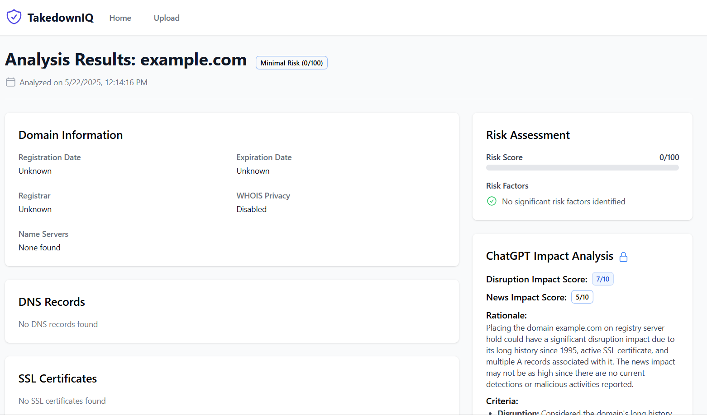

# TakedownIQ

<p align="center">
  
</p>

## Overview

TakedownIQ is a comprehensive domain analysis tool designed to help security professionals and website owners analyze suspicious domains without visiting them directly. The application provides detailed risk assessments, WHOIS information, DNS records, SSL certificate data, and VirusTotal scan results, all in one place.

## Features

- **Domain Analysis**: Analyze domains for potential security threats
- **File Upload**: Upload evidence files for analysis
- **Risk Assessment**: Get a comprehensive risk score and detailed risk factors
- **WHOIS Lookup**: View domain registration information
- **DNS Records**: Analyze A, MX, NS, and TXT records
- **SSL Certificate Validation**: Check certificate validity and details
- **VirusTotal Integration**: View scan results from multiple security engines
- **ChatGPT Impact Analysis**: AI-powered assessment of potential impact
- **PDF Reports**: Generate detailed reports for documentation

## Tech Stack

### Frontend
- React.js with Vite
- Tailwind CSS for styling
- Framer Motion for animations
- Axios for API requests
- React Router for navigation

### Backend
- Python with FastAPI
- WHOIS/RDAP for domain information
- DNS libraries for record lookup
- OpenSSL for certificate validation
- VirusTotal API integration
- OpenAI API for ChatGPT analysis
- WeasyPrint for PDF generation

## Architecture

The application follows a client-server architecture:

- **Frontend**: Single-page React application that handles user interactions and displays results
- **Backend**: FastAPI server that processes requests, performs domain analysis, and returns structured data
- **External APIs**: Integration with VirusTotal and OpenAI for enhanced analysis

## Installation

### Prerequisites
- Node.js (v16+)
- Python (v3.9+)
- Nginx (for production deployment)

### Frontend Setup

```bash
cd frontend
npm install
npm run dev  # Development server
npm run build  # Production build
```

### Backend Setup

```bash
cd backend
python -m venv venv
source venv/bin/activate  # On Windows: venv\Scripts\activate
pip install -r requirements.txt
python main.py
```

## Deployment

The application is configured for deployment with Nginx as a reverse proxy. The frontend is built as static files and served by Nginx, while the backend runs as a Python service.

### Nginx Configuration

The Nginx configuration includes:
- Static file serving for the frontend
- Proxy configuration for API requests
- CORS headers for cross-origin requests
- Proper error handling and timeouts

## Error Handling

The application includes comprehensive error handling:

- Multiple API endpoint fallbacks for better reliability
- Detailed error messages with troubleshooting steps
- User-friendly error UI with visual cues
- Extensive logging for debugging

## Contributing

Contributions are welcome! Please feel free to submit a Pull Request.

## License

This project is licensed under the MIT License - see the LICENSE file for details.
